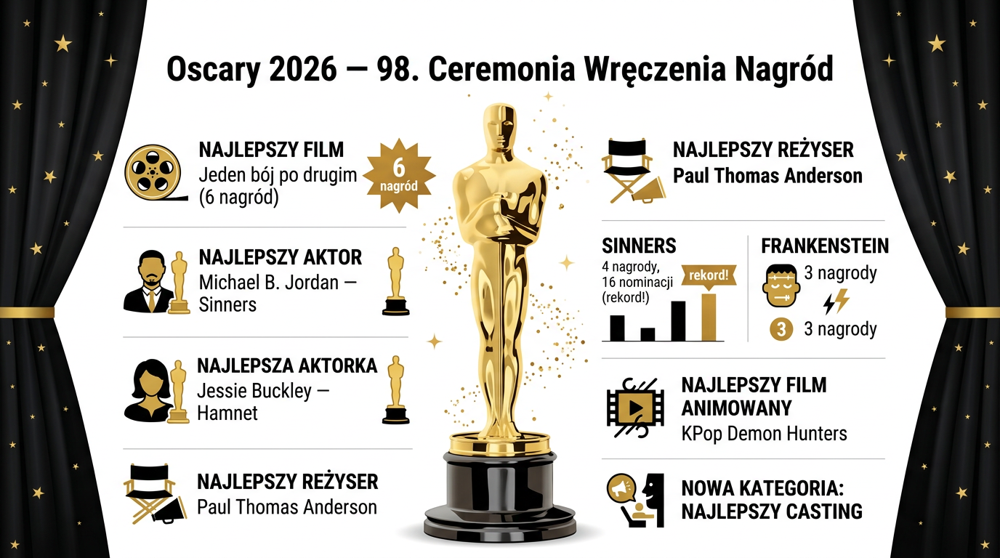

# Oscary 2026 — Podsumowanie 98. Ceremonii Wręczenia Nagród

> **Abstrakt:** 98. ceremonia wręczenia Oscarów odbyła się 15 marca 2026 w Dolby Theatre w Hollywood. Największym triumfatorem wieczoru był film **"One Battle After Another"** Paula Thomasa Andersona z 6 statuetkami, w tym za Najlepszy Film i Reżyserię. Film **"Sinners"** Ryana Cooglera pobił rekord wszech czasów z 16 nominacjami, zdobywając 4 nagrody.

---

## Kluczowe ustalenia

- **"One Battle After Another" — 6 Oscarów** (Najlepszy Film, Reżyseria, Scenariusz Adaptowany, Aktor Drugoplanowy, Montaż, Casting)
- **"Sinners" — 16 nominacji** (nowy rekord historyczny, bijąc *All About Eve*, *Titanic* i *La La Land* z 14)
- **Autumn Durald Arkapaw** — pierwsza kobieta w historii Oscarów nagrodzona za Najlepsze Zdjęcia (*Sinners*)
- **Nowa kategoria: Najlepsze Castingowanie** — wprowadzona po raz pierwszy, inauguracyjnym laureatem: Cassandra Kulukundis
- **Polski akcent:** Chris Lavis i **Maciek Szczerbowski** — Oscar za Najlepszy Krótki Film Animowany (*The Girl Who Cried Pearls*)

---

*98. ceremonia wręczenia Oscarów — Dolby Theatre, Hollywood, 15 marca 2026*

---

## Ceremonia

| Szczegół | Informacja |
|----------|-----------|
| Data | 15 marca 2026 |
| Miejsce | Dolby Theatre, Hollywood, Los Angeles |
| Prowadzący | Conan O'Brien (2. rok z rzędu) |
| Transmisja USA | ABC i Hulu |
| Transmisja PL | Canal+ |
| Liczba kategorii | 24 (w tym 1 nowa: Casting) |

---

## Zwycięzcy — pełna lista

### Główne nagrody

| Kategoria | Zwycięzca | Film |
|-----------|-----------|------|
| 🏆 Najlepszy Film | — | [One Battle After Another](https://www.imdb.com/title/tt30144839/) |
| 🎬 Reżyseria | Paul Thomas Anderson | [One Battle After Another](https://www.imdb.com/title/tt30144839/) |
| 👨 Aktor pierwszoplanowy | **Michael B. Jordan** | [Sinners](https://www.imdb.com/title/tt31193180/) |
| 👩 Aktorka pierwszoplanowa | **Jessie Buckley** | [Hamnet](https://www.imdb.com/title/tt14905854/) |
| 👨 Aktor drugoplanowy | **Sean Penn** | [One Battle After Another](https://www.imdb.com/title/tt30144839/) |
| 👩 Aktorka drugoplanowa | **Amy Madigan** | [Weapons](https://www.imdb.com/title/tt26581740/) |
| ✍️ Scenariusz adaptowany | Paul Thomas Anderson | [One Battle After Another](https://www.imdb.com/title/tt30144839/) |
| ✍️ Scenariusz oryginalny | Ryan Coogler | [Sinners](https://www.imdb.com/title/tt31193180/) |

### Film animowany i muzyka

| Kategoria | Zwycięzca | Film |
|-----------|-----------|------|
| 🎨 Animacja pełnometrażowa | — | [KPop Demon Hunters](https://www.imdb.com/title/tt14205554/) |
| 🎨 Krótki film animowany | Chris Lavis, **Maciek Szczerbowski** | *The Girl Who Cried Pearls* |
| 🎵 Muzyka (oryginalna ścieżka) | **Ludwig Göransson** | [Sinners](https://www.imdb.com/title/tt31193180/) |
| 🎵 Piosenka oryginalna | "Golden" | [KPop Demon Hunters](https://www.imdb.com/title/tt14205554/) |

### Techniczne i artystyczne

| Kategoria | Zwycięzca | Film |
|-----------|-----------|------|
| 📷 Zdjęcia | **Autumn Durald Arkapaw** *(1. kobieta!)* | [Sinners](https://www.imdb.com/title/tt31193180/) |
| 🎭 Kostiumy | — | Frankenstein |
| 💄 Charakteryzacja | — | Frankenstein |
| 🏠 Scenografia | — | Frankenstein |
| 🎞️ Montaż | Andy Jurgensen | [One Battle After Another](https://www.imdb.com/title/tt30144839/) |
| 🎭 Casting *(NOWA KATEGORIA)* | **Cassandra Kulukundis** | [One Battle After Another](https://www.imdb.com/title/tt30144839/) |

### Film międzynarodowy i dokumentalny

| Kategoria | Zwycięzca | Film |
|-----------|-----------|------|
| 🌍 Międzynarodowy film fabularny | — | [Sentimental Value](https://www.imdb.com/title/tt27714581/) (Norwegia, reż. Joachim Trier) |
| 📽️ Dokument pełnometrażowy | — | [Mr. Nobody Against Putin](https://www.imdb.com/title/tt34965515/) |

---

## Bilans filmów

| Film | Nominacje | Nagrody | IMDB |
|------|-----------|---------|------|
| One Battle After Another | — | **6** 🥇 | [link](https://www.imdb.com/title/tt30144839/) |
| Sinners | **16** (rekord!) | 4 | [link](https://www.imdb.com/title/tt31193180/) |
| Frankenstein (del Toro) | — | 3 | [link](https://www.imdb.com/title/tt1312221/) |
| KPop Demon Hunters | — | 2 | [link](https://www.imdb.com/title/tt14205554/) |
| Hamnet | — | 1 | [link](https://www.imdb.com/title/tt14905854/) |
| Weapons | — | 1 | [link](https://www.imdb.com/title/tt26581740/) |
| Sentimental Value | — | 1 | [link](https://www.imdb.com/title/tt27714581/) |
| Mr. Nobody Against Putin | — | 1 | [link](https://www.imdb.com/title/tt34965515/) |
| Marty Supreme | 9 | 0 ❌ | [link](https://www.imdb.com/title/tt32916440/) |

---

## Rekordy i historyczne momenty

1. **Nowy rekord nominacji:** *Sinners* — 16 nominacji, bijąc 74-letni rekord *All About Eve* (1950)
2. **Pierwsza kobieta z Oscarem za zdjęcia:** Autumn Durald Arkapaw (*Sinners*)
3. **Pierwsza piosenka k-popowa z Oscarem:** "Golden" z *KPop Demon Hunters*
4. **Nowa kategoria Casting** — po raz pierwszy w historii nagród (poprzednia nowa kategoria: Animacja w 2002)
5. **Sean Penn** — odebrał nagrodę za aktorstwo po wieloletniej przerwie; nie był obecny na ceremonii
6. **Największy przegrany:** *Marty Supreme* (reż. Josh Safdie, Timothée Chalamet) — 9 nominacji, 0 nagród

---

## Polski akcent

**Maciek Szczerbowski** (wraz z Chrisem Lavisem) zdobył Oscara za Najlepszy Krótki Film Animowany *The Girl Who Cried Pearls*. To kolejny sukces polskich twórców animacji na największej scenie filmowej.

---

## Wnioski

Gala 2026 przyniosła kilka przełomowych momentów. Paul Thomas Anderson potwierdził swój status jednego z najważniejszych reżyserów Hollywood, zdobywając Oscar za reżyserię i scenariusz. *Sinners* Ryana Cooglera okazał się filmem dekady pod względem liczby nominacji, choć nie przełożyło się to na dominację w nagrodach. Rok 2026 był szczególnie przełomowy dla reprezentacji — pierwsza kobieta za zdjęcia, pierwsza k-popowa piosenka z Oscarem i nowa kategoria Casting, długo oczekiwana przez branżę.

---

*Wygenerowano: 2026-03-16 | Źródła: 8 | Rundy: 2 | Zapytanie: "Zrób podsumowanie Oscarów 2026. Przygotuj infografikę oraz dodaj linki do filmów na IMDB."*
